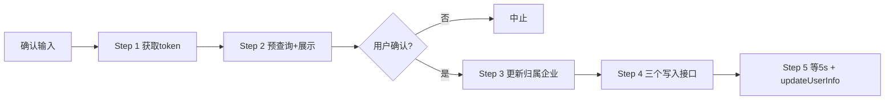

# DT 座舱信息修改

修改某 IMEI 设备在 DT 平台上的**归属企业**，并重建其安装记录。只接受**显式调用**（用户明确要求执行此 skill 才运行），不响应任何自然语言触发。

## 概念澄清

| 术语 | iot 字段 | 脚本参数 | 说明 |
|---|---|---|---|
| **归属企业**（原"生产企业"） | `ownerCompany` / `ownerCompanyId` | `--owner-company` | 设备的归属/销售主体，从 `basic.company` 按名字查 id/name |
| **农机企业**（保持不变） | `company` | `--company` | 农机（机具）关联企业，用于按该企业的 `company_id` 查 `model.model` 型号 |

> 历史命名：**归属企业**此前被称为"生产企业"，现已澄清更名，含义不变；脚本/接口中的参数名（`--owner-company`、`ownerCompany*` 字段）和 `ownerCompanyTypeName` 的接口值"生产企业"均属于既有契约，保持不变。

## 调用前确认（必须）

向用户确认三个输入：

1. **IMEI**（必填）
2. **目标归属企业**（必填，改为谁，如 `山东天海重工有限公司`）
3. **农机企业 / 农机型号**（可选，默认 `第一拖拉机股份有限公司` / `LP2204-C`）

## Step 0: 环境检查

```bash
python "E:/Dev/jianglei/skills/dt-cabin-modify/scripts/check_env.py"
```

检查三项（只输出 PASS/FAIL 状态，**绝不输出凭据值**，避免凭据进入对话上下文）：

1. `dbx` CLI 已安装（缺失时输出安装命令 `npm install -g @dbx-app/cli`）
2. 环境变量 `DT_USERNAME` / `DT_PASSWORD` 已设置（只报缺失的变量名）
3. dbx 连接 `prod_192.168.5.17_machine` 存在

任一 FAIL 即停止，修复后重跑。连接配置方法见 [README.md](README.md)。

## 流程总览



## Step 1: 获取登录 token

```bash
TOKEN=$(python "E:/Dev/jianglei/skills/dt-cabin-modify/scripts/get_token.py")
```

从环境变量 `DT_USERNAME` / `DT_PASSWORD` 读取凭据，登录 `dss.datian360.com/prod_api/auth/v1/login`，打印 `data.result.access_token`。凭据缺失则退出并提示。

## Step 2: 预查询并展示（只读，无写入）

```bash
python "E:/Dev/jianglei/skills/dt-cabin-modify/scripts/preview.py" \
  --token "$TOKEN" --imei <IMEI> --owner-company "<目标归属企业>" \
  [--company "<农机企业>"] [--model "<农机型号>"]
```

一次性查询并展示（全部只读，不产生任何写入）：

- `[1] 设备当前信息` — queryByImei 返回的现有归属企业/型号/品目/terminal 等
- `[2] 目标归属企业` — `basic.company` 按名字查 id/name
- `[3] 农机企业+型号` — `basic.company`（农机企业）+ `model.model` 按 `company_id`+`model` 查 id/categoryId1-3/class_name3
- `[4] 安装记录` — sales/install/view，有记录则提示将删除
- `[5] 决策汇总` — 是否需要更新归属企业、是否有中止条件

**等待用户确认后再进入 Step 3。** 任何 [ABORT]（归属企业/农机企业/型号未查到）出现时流程不得继续。

## Step 3-5: 执行全流程

```bash
python "E:/Dev/jianglei/skills/dt-cabin-modify/scripts/run_flow.py" \
  --token "$TOKEN" --imei <IMEI> --owner-company "<目标归属企业>" \
  [--company "<农机企业>"] [--model "<农机型号>"] --yes
```

`--yes` 表示用户已确认（Step 2 后必须获得用户明确确认才加）。`run_flow.py` 内部仍会先跑一遍 preview 再依次执行：

| 顺序 | 脚本 | 动作 |
|---|---|---|
| 1 | `update_sale_info.py` | 更新归属企业 + 时间字段（sellTime/sendTime/commServiceBeginDate=今天00:00:00，commServiceEndDate=3年后00:00:00）。决策：查到且 ownerCompany≠目标 → 更新；未查到 → 也更新；企业不存在 → 中止 |
| 2 | `install_iot_insert.py` | 写入①：安装信息（body 示例 + 替换 imei） |
| 3 | `install_iot_machine_insert.py` | 写入②：农机信息（dbx 查 company/model，随机 6 位字母数字+000000 的 factoryNumber，productionDate=今天） |
| 4 | `install_iot_owner_insert.py` | 写入③：机主信息（body 示例 + 替换 imei） |
| 5 | `update_user_info.py --delay 5` | 等 5 秒后调 updateUserInfo |

**本流程不删除任何安装记录。** 任一步失败即停止，不继续后续步骤。

## 环境要求

- `DT_USERNAME` / `DT_PASSWORD` 环境变量（登录凭据）
- `dbx` CLI 已安装且 `prod_192.168.5.17_machine` 连接可用（machine 库，`basic.company` / `model.model` 表）
- Python 3（仅标准库，无第三方依赖）

## 脚本清单

| 脚本 | 用途 | 只读/写入 |
|---|---|---|
| `check_env.py` | 环境检查（dbx/变量/连接） | 只读 |
| `get_token.py` | 登录拿 token | 只读 |
| `query_by_imei.py` | 查设备信息 | 只读 |
| `preview.py` | 预查询全部数据并展示 | 只读 |
| `update_sale_info.py` | 更新归属企业/时间 | 写入 |
| `handle_install.py` | 查安装记录，有则删 | 有条件写入 |
| `install_iot_insert.py` | 写入① | 写入 |
| `install_iot_machine_insert.py` | 写入② | 写入 |
| `install_iot_owner_insert.py` | 写入③ | 写入 |
| `update_user_info.py` | 最终 updateUserInfo | 写入 |
| `run_flow.py` | 全流程串联 | 写入 |
