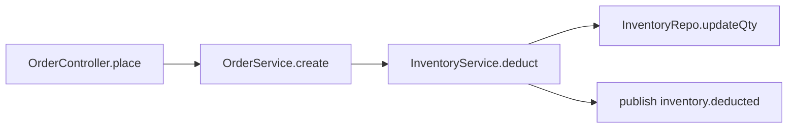

# Worked example

One full pass: input → scope sketch → explanation.

The skill's own text is English (repo convention). The explanation it produces follows the user's language — so a Chinese request produces a Chinese explanation. This example stays English for readability.

## 1. Input

> /explain-logic 扣库存这段逻辑

The user named one piece of business logic. No boundary was given, so the skill derives one.

## 2. Scope sketch

Traced upstream to the natural entry and downstream to the natural terminus:

| Step | Location | Responsibility | Direction |
|---|---|---|---|
| 1 | `api/OrderController.ts:42` | HTTP entry: `POST /orders` | upstream edge |
| 2 | `service/OrderService.ts:118` | Validate cart, create order row | upstream |
| 3 | `service/InventoryService.ts:64` | **Deduct stock — the named logic** | target |
| 4 | `repo/InventoryRepo.ts:31` | `UPDATE inventory SET qty = qty - ?` | downstream |
| 5 | `service/InventoryService.ts:81` | Publish `inventory.deducted` | downstream edge |



**Proposed termini:** upstream stops at step 1 (HTTP entry), downstream at step 5. Step 5 hands off to the fulfilment consumer, which belongs to a different business and is therefore **not** part of this chain.

The skill stops here and waits for confirmation.

## 3. Explanation

### 1. What it does

Deducts ordered quantities from stock when an order is placed, and refuses the order if any line lacks sufficient stock. It runs inside the order-creation transaction, so the stock write and the order row either both land or neither does.

### 2. Key design decisions

- **Single conditional `UPDATE` instead of read-then-write.** The stock check is enforced by the database, not by application code:

  ```sql
  -- InventoryRepo.ts:31 — the WHERE clause IS the stock check
  UPDATE inventory SET qty = qty - :n
   WHERE sku = :sku AND qty >= :n
  ```

  This makes concurrent orders safe without an explicit row lock. A read-then-write pair would allow two orders to both observe `qty = 1`.

- **Keyed by `sku`, not by product id.** Stock is tracked per sellable variant, so the deduction key must be the variant, not the parent product.
- **Failure is an exception, not a return value.** `deduct` throws `InsufficientStockError` so the surrounding transaction rolls back — a returned `false` would need every caller to remember to abort.

### 3. Execution walkthrough

**Step 3 — `InventoryService.deduct`** (`service/InventoryService.ts:64`), the named logic:

```ts
async deduct(lines: OrderLine[], tx: Transaction) {
  // Sort by sku so concurrent orders lock rows in a stable order.
  const sorted = [...lines].sort((a, b) => a.sku.localeCompare(b.sku));

  for (const line of sorted) {
    const affected = await this.repo.updateQty(line.sku, line.qty, tx);
    // 0 rows means the WHERE guard rejected it: not enough stock.
    if (affected === 0) {
      throw new InsufficientStockError(line.sku);
    }
  }
}
```

**Step 4 — `InventoryRepo.updateQty`** (`repo/InventoryRepo.ts:31`): runs the conditional `UPDATE` above on the passed transaction. Returns the affected row count; it never throws on insufficient stock.

**Step 5 — publish** (`service/InventoryService.ts:81`): emits `inventory.deducted` after the loop, still inside the transaction.

### 4. Edge cases and gotchas

- **Zero-quantity lines still hit the database.** A line with `qty = 0` passes the guard (`qty >= 0` is true) and writes a no-op `UPDATE`. Harmless, but it means the loop's cost scales with line count, not with actual stock changes.
- **Duplicate SKUs in one order are not merged.** The same `sku` appearing twice deducts twice — correct in total, but the first failure aborts the second line's deduction with a message naming only that SKU, which reads as confusing to the user.
- **The event is published before commit.** Step 5 fires inside the transaction, so a rollback afterwards leaves a consumer holding an `inventory.deducted` event for stock that was never deducted. See layer 5.

### 5. Changing it safely

- **Invariants:** `qty` must never go negative — the `WHERE qty >= :n` guard is the only thing enforcing it. Removing or loosening that clause silently breaks the guarantee under concurrency.
- **The stable sort at line 66 is load-bearing.** It exists to prevent deadlocks between concurrent orders touching overlapping SKUs. Removing it as a "pointless copy" introduces intermittent deadlocks under load.
- **What breaks if you move the event outside the transaction:** this is the change most likely to be proposed. Doing so fixes the phantom-event gotcha above, but loses ordering relative to the order row commit — the consumer may observe the event before the order is visible. Decide deliberately; do not move it as a drive-by cleanup.

## 4. Excluded reads

- `service/CouponService.ts:22` — read to check whether pricing changes before stock deduction — coupon pricing, not stock
- `consumer/FulfilmentConsumer.ts:57` — read to confirm where `inventory.deducted` lands — fulfilment business, past the chain's terminus
