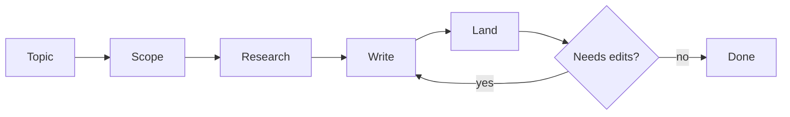

# Topic Note

Given a topic, research it and write it up as **one** self-contained Markdown document. One file, one topic — never multiple files, never folder structures.

## Workflow

## Step 1: Scope

State in one sentence what the document will cover, and list its sub-topics. If the topic is ambiguous, pick the most useful reading and note it in the overview.

**Done when:** you can say in one sentence what the document covers.

## Step 2: Research

Dispatch a **background agent** to gather material on the sub-topics, following the sourcing discipline in [`references/sourcing.md`](references/sourcing.md): primary sources first, every substantive claim sourced, no parametric knowledge.

**Done when:** every planned sub-topic has at least one sourced claim behind it.

## Step 3: Write

Write the document in the **user's language**. Follow the structure skeleton in [`references/structure.md`](references/structure.md) and the writing rules in [`references/writing.md`](references/writing.md).

The document opens with an overview and goes straight into the concepts — no "why you should care" preamble.

**Done when:** every hard concept has an analogy and an example; every substantive claim is attributed to a source by name; the document is one file.

## Step 4: Land

Write the file to the **current directory**, or to a path the user specifies. Name the file from its content — the distilled title of the document, in the same language. If the file already exists, ask the user: overwrite, rename, or pick another location.

Then ask the user whether the document needs adjustments.

**Done when:** the file is written and the user has confirmed or requested edits.
